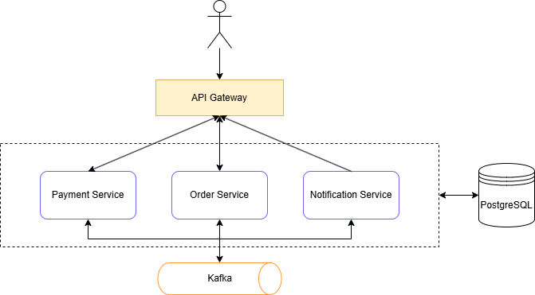

# Cloud Payment Platform

Cloud Payment Platform is a portfolio project designed to explore backend architecture concepts such as microservices, distributed systems, scalability, observability, resilience and cloud-native deployments.

The goal of this project is not only to build a working system, but also to document the architectural decisions behind it and use it as a learning platform.

## Project goals

- Design a backend system using microservices
- Explore distributed systems trade-offs
- Learn event-driven architecture concepts
- Practice observability and resilience patterns
- Deploy services in containerized and cloud-native environments

## Planned stack

| Category       | Technology                  |
|----------------|-----------------------------|
| Language       | Java 17 (LTS)               |
| Framework      | Spring Boot 4.0.3           |
| Database       | PostgreSQL 14               |
| ORM            | Spring Data JPA / Hibernate |
| Build          | Gradle                      |
| API Docs       | springdoc-openapi           |
| Message broker | Kafka                       |
| Caching        | Redis                       |
| Observability  | Prometheus / Grafana        |
| Testing        | JUnit 5                     |
| CI/CD          | GitHub Actions / Terraform  |
| Container      | Docker / Kubernetes         |

## Initial architecture

The initial version of the platform is based on the following:

- See [Architecture v1](docs/architecture-v1.md)

## Quickstart

For setup instructions, see:
- [Local (Docker) setup](docs/setup-local.md)
- [Kubernetes setup] Planned
- [AWS setup] Planned

## API Documentation

Once the applications are running, access the interactive API documentation:

| Service              | Swagger UI                            | OpenAPI Spec                   |
|----------------------|---------------------------------------|--------------------------------|
| order-service        | http://localhost:8080/swagger-ui.html | http://localhost:8080/api-docs |
| payment-service      | http://localhost:8081/swagger-ui.html | http://localhost:8081/api-docs |
| notification-service | http://localhost:8082/swagger-ui.html | http://localhost:8082/api-docs |

### Payments

| Method   | Service         | Endpoint       | Description          |
|----------|-----------------|----------------|----------------------|
| `POST`   | payment-service | `/v1/payments` | Create a new payment |
| `POST`   | order-service   | `/v1/orders`   | Create a new order   |

## Roadmap

- See [Roadmap](docs/roadmap.md)